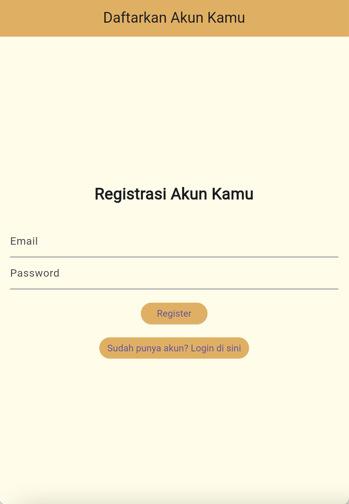
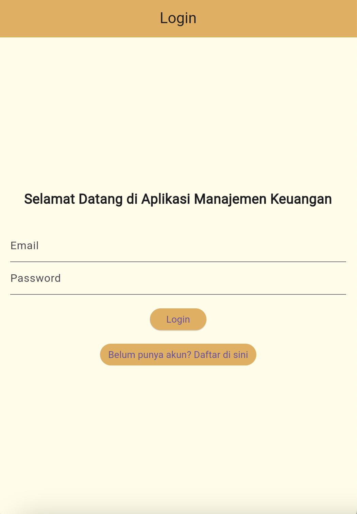
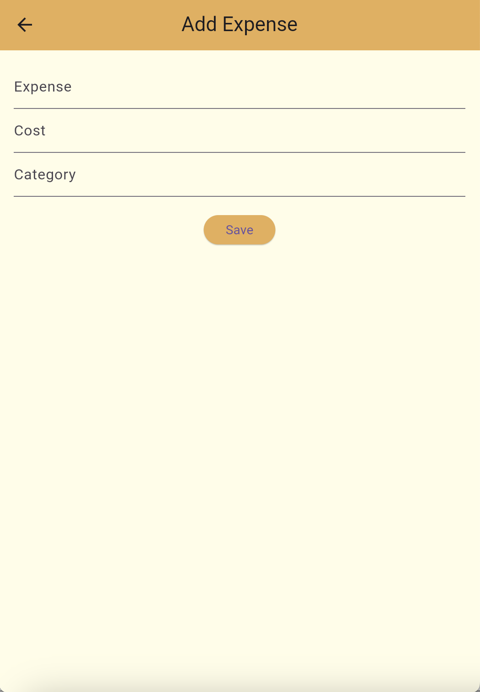
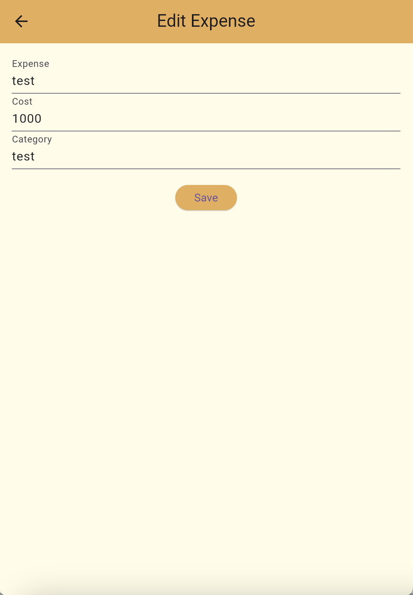
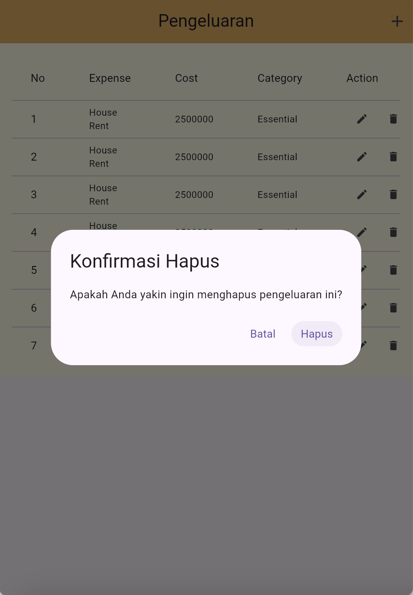

<<<<<<< HEAD
# responsi1-pemmob-H1D021018
=======
# manaj_keuangan_app

register_screen.dart : File RegisterScreen adalah widget Flutter yang mengelola proses pendaftaran pengguna. Pengguna memasukkan email dan password melalui TextField, yang kemudian dikirim ke server menggunakan permintaan HTTP POST. Jika pendaftaran berhasil (status 200), aplikasi menampilkan dialog sukses dan mengarahkan pengguna ke halaman login; jika gagal, muncul dialog kesalahan. 

login_screen.dart : File LoginScreen adalah widget Flutter yang menyediakan antarmuka untuk pengguna melakukan login ke aplikasi. Pengguna diminta untuk memasukkan email dan password melalui TextField, dengan desain yang menampilkan latar belakang kuning pastel dan tombol berwarna oranye. Saat pengguna menekan tombol login, logika login perlu ditambahkan untuk memproses autentikasi. Jika pengguna belum memiliki akun, mereka dapat menavigasi ke halaman registrasi dengan menekan tombol yang sesuai.

expense_screen.dart: File ExpenseScreen adalah bagian dari aplikasi yang memungkinkan pengguna untuk mengelola pengeluaran mereka melalui operasi CRUD (Create, Read, Update, Delete). Saat halaman dimuat, data pengeluaran diambil dari database menggunakan DatabaseHelper dan ditampilkan dalam bentuk tabel dengan kolom untuk nomor, jenis pengeluaran, biaya, kategori, dan aksi (edit/delete). Pengguna dapat menambah pengeluaran baru dengan menekan tombol "+" yang akan membawa mereka ke halaman detail pengeluaran, dan setiap baris pengeluaran memiliki tombol edit dan delete. Proses penghapusan diimplementasikan dengan konfirmasi untuk memastikan pengguna ingin menghapus data.

![Tampil data(assets/Tampil.png)

